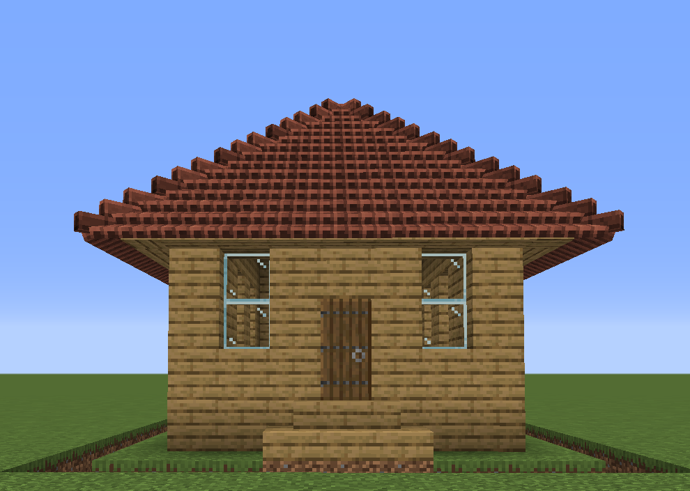
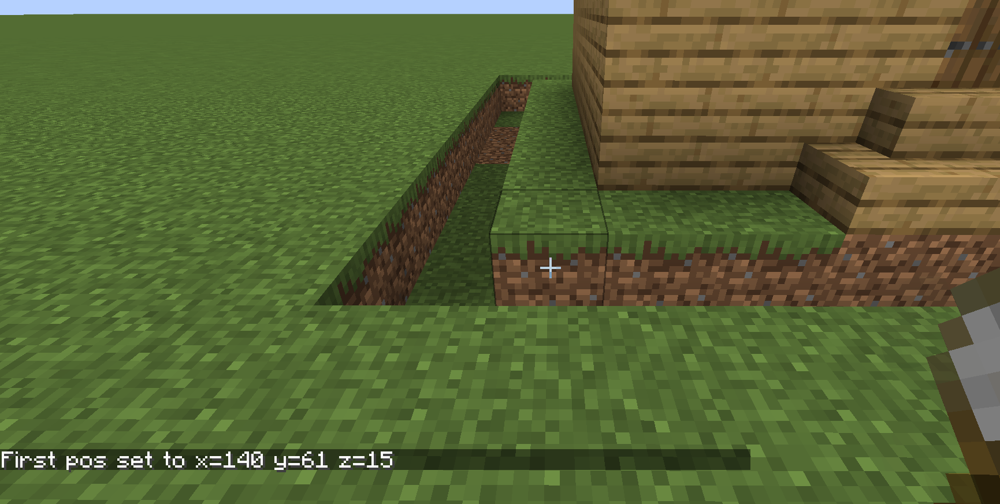
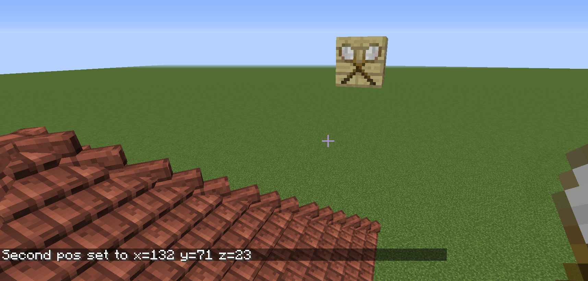
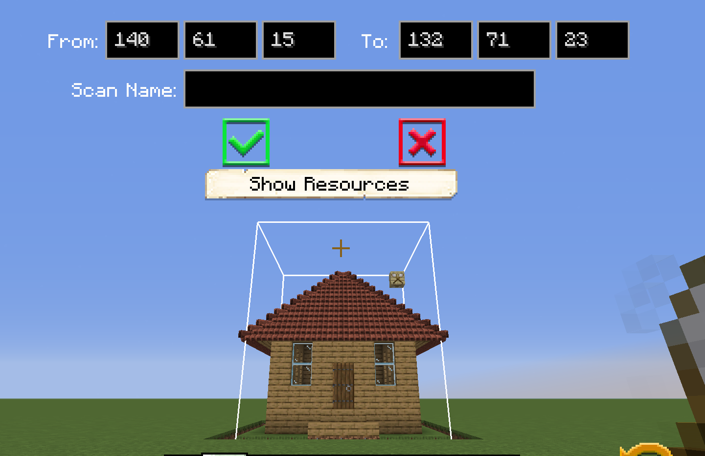

# Schematics

Schematics are files containing block and entity information of a certain area a player scanned with the [Scan Tool](../items/scantool) in-game. You can use the scan tool and scan ANY building or structure you like in SSP or even SMP and then have your builder "Build it" for you (provided that you give him all the materials needed of course).

- [Schematics](#schematics)
  - [Scanning a New Structure](#scanning-a-new-structure)
  - [Placing a Schematic.](#placing-a-schematic)
  - [FAQ](#faq)
      - [What and Where is the scans folder?](#what-and-where-is-the-scans-folder)
      - [Where is the schematic folder?](#where-is-the-schematic-folder)
      - [I have a "*/minecolonies/01e6a291-8a01-4763-bcae-f3a8797b1d52/cache/" folder, what is that for?](#i-have-a-%22minecolonies01e6a291-8a01-4763-bcae-f3a8797b1d52cache%22-folder-what-is-that-for)
      - [How to create custom huts?](#how-to-create-custom-huts)
      - [How to override some built-in schematics?](#how-to-override-some-built-in-schematics)
      - [How to use custom huts?](#how-to-use-custom-huts)
      - [How to allow my players to use their own huts' schematics on my server?](#how-to-allow-my-players-to-use-their-own-huts-schematics-on-my-server)
      - [How to allow my players to use their scanned schematics on my server?](#how-to-allow-my-players-to-use-their-scanned-schematics-on-my-server)
      - [How to disable built-in schematics completely?](#how-to-disable-built-in-schematics-completely)

## Scanning a New Structure

Once you build or have a structure or area you want to scan to have your builder build later in game, you need to determine the exact "cube" area you need. 

Take your [Scan Tool](../items/scantool) and Left click the lowest left block of the area and then place a block in the top right corner and Right click on it.

Then click in the air to see the entire structure.

Once you have the full area set, you can press esc and the white outline of the scan area will stay in place. Go around it to double check that everything you want is in the scan area. When you are ready, you can click in the air again to get the GUI to display again where you can enter your scan name. Then press the green check to save the scan.

Scans are saved in `../minecolonies/scan/new/...`

Once the scans are save, they need moved to the `../structurize/schematics/(folder)/file`

## Placing a Schematic.

Once you have scanned a structure, you can use the build tool to have your builder "build it" for you. Once you right click with the Build Tool you will have to select "My Schematics" (in the left drop down menu) and on the right side drop down menu you will see the scans that you have made.There is also a "Rename" button where you can change the name that was originally assigned to the scan (for example: SCAN_1533778290135) to whatever you like. You can also "delete" any of your saved scans.

## FAQ

This is a FAQ section to answer most questions regarding schematics in Minecolonies.

#### What and Where is the scans folder?

The scans folder is where the schematics are saved after performing a scan using the scan tool in Minecolonies. This is a client side only directory which is located in Minecraft's folder under: `*/structurize/scans/`. Freshly scanned schematics can be found in `*/structurize/scans/new/` unless they have been renamed in game. This directory is shared between all your Single Player games and Multi Player games.

#### Where is the schematic folder?

Custom schematics need to be copied inside the schematic folder: `*\structurize\schematics\` (or `*\structurize\schematics\` for Mac and Linux).

The location of this folder depends of the type of game:

- For a Single Player game, there are 2 possible locations:
  * In the world folder: `*/minecraft/saves/(World Name)/structurize/schematics/`
    + **Note:** Use this directory when you want to use custom schematics restricted to the world. When this directory exists (even empty), minecolonies will completely ignore the other directory.
  * In the Minecraft's folder: `*/minecraft/structurize/schematics/`
    + **Note:** Use this folder when you want to have the same custom schematics across multiple worlds.
- For a Multiplayer game, the schematics are always loaded from the world's directory under: `*/minecolonies/schematics/` directory.

#### I have a "*/minecolonies/01e6a291-8a01-4763-bcae-f3a8797b1d52/cache/" folder, what is that for?

When playing on a server, the server needs to send the schematics to the players so that the build tool's preview works. Those schematics are saved in Minecraft's directory under `*/structurize/{ServerUUID}/cache/`, where ServerUUID is the unique identifier of the server. Those directories can be safely removed as they are automatically created by the server when needed.

#### How to create custom huts?

To create new schematics for existing huts, there are some guidelines that you must follow: The scans MUST have the same footprint for the same style/Hut's type; The scans must contain the hut's chest i.e. builder's chest for the builder's hut, Citizen's chest for the Citizen's hut and so on. The hut chest need to be exactly at the same place and have the same rotation for each level; The scans' filenames need to follow the naming convention: {StyleName}/{HutName}{HutLevel}.blueprint. For example, for the builder's huts with the MyOwn style, we would have:

*myown/builder1.blueprint*
*myown/builder2.blueprint*
*myown/builder3.blueprint*
*myown/builder4.blueprint*
*myown/builder5.blueprint*

- **Note:** in the build tool, the extension is hidden. HutName can be any of the listed huts below. The maximum level is 5.

Once ready, move the myown folder into the schematics folder and start your game. You should be able to see it with the the build tool.

- **Note:** Remember that you need the appropriate hut in your inventory to be able to see the schematics in the build tool.

Custom Hut Filenames

Here is a full list, up-to-date as of 9 February 2020, of the building names. **Please note**, *capitalization matters*.

| Level 1        | Level 2        | Level 3        | Level 4        | Level 5        |
| :------------- | :------------- | :------------- | :------------- | :------------- |
| archery1       | archery2       | archery3       | archery4       | archery5       |
| baker1         | baker2         | baker3         | baker4         | baker5         |
| barracks1      | barracks2      | barracks3      | barracks4      | barracks5      |
| barrackstower1 | barrackstower2 | barrackstower3 | barrackstower4 | barrackstower5 |
| blacksmith1    | blacksmith2    | blacksmith3    | blacksmith4    | blacksmith5    |
| builder1       | builder2       | builder3       | builder4       | builder5       |
| chickenherder1 | chickenherder2 | chickenherder3 | chickenherder4 | chickenherder5 |
| citizen1       | citizen2       | citizen3       | citizen4       | citizen5       |
| combatacademy1 | combatacademy2 | combatacademy3 | combatacademy4 | combatacademy5 |
| composter1     | composter2     | composter3     | composter4     | composter5     |
| cook1          | cook2          | cook3          | cook4          | cook5          |
| cowboy1        | cowboy2        | cowboy3        | cowboy4        | cowboy5        |
| crusher1       | crusher2       | crusher3       | crusher4       | crusher5       |
| deliveryman1   | deliveryman2   | deliveryman3   | deliveryman4   | deliveryman5   |
| enchanter1     | enchanter2     | enchanter3     | enchanter4     | enchanter5     |
| farmer1        | farmer2        | farmer3        | farmer4        | farmer5        |
| fisherman1     | fisherman2     | fisherman3     | fisherman4     | fisherman5     |
| florist1       | florist2       | florist3       | florist4       | florist5       |
| guardtower1    | guardtower2    | guardtower3    | guardtower4    | guardtower5    |
| library1       | library2       | library3       | library4       | library5       |
| lumberjack1    | lumberjack2    | lumberjack3    | lumberjack4    | lumberjack5    |
| miner1         | miner2         | miner3         | miner4         | miner5         |
| sawmill1       | sawmill2       | sawmill3       | sawmill4       | sawmill5       |
| shepherd1      | shepherd2      | shepherd3      | shepherd4      | shepherd5      |
| sifter1        | sifter2        | sifter3        | sifter4        | sifter5        |
| smeltery1      | smeltery2      | smeltery3      | smeltery4      | smeltery5      |
| stonemason1    | stonemason2    | stonemason3    | stonemason4    | stonemason5    |
| stonesmeltery1 | stonesmeltery2 | stonesmeltery3 | stonesmeltery4 | stonesmeltery5 |
| swineherder1   | swineherder2   | swineherder3   | swineherder4   | swineherder5   |
| townhall1      | townhall2      | townhall3      | townhall4      | townhall5      |
| university1    | university2    | university3    | university4    | university5    |
| warehouse1     | warehouse2     | warehouse3     | warehouse4     | warehouse5     |

### Requirements

| Building       | Requirements                          | Suggested       | 
| :------------- | :-------------                        | :-------------  | 
| archery        | 1 archery dummy per level             |                 | 
| baker          | 1 furnace per level                   |                 | 
| barracks       | 1 barracks tower per level (to lvl 4) |                 |
| barracks tower |                                       | 1 bed per level |
| citzens        |                                       | 1 bed per level |
| combat academy | 1 combat dummy per level              |                 |
| composter      | 1 composter barrel per level          |                 |
| cook           | 1 furnace per level                   |                 |
| florist        | 4 compost plots per level             |                 |
| guard tower    |                                       | 1 bed per level |
| hospital       | 1 bed per level                       |                 |
| library        | bookshelves                           |                 |
| smeltery       | 1 furnace per level                   |                 |
| stonesmeltery  | 1 furnace per level                   |                 |
| university     | bookshelves                           |                 |

#### How to override some built-in schematics?

Simply create a schematic file with the same style/name. For instance to override the Builder's hut level 1 in wooden, create a schematic file name called wooden/builder1.blueprint.

#### How to use custom huts?

The custom huts need to be copied in the schematics folder. Once copied, you may start your single player or your multiplayer game as usual, you should see them in the build tool.

#### How to allow my players to use their own huts' schematics on my server?

You will have to copy them yourself in the schematics folder on the server and restart it.

#### How to allow my players to use their scanned schematics on my server?

Edit the configuration file and set allowPlayerSchematics to true. This allow the player to use its own decorations. It is not possible for the player to use is own huts' schematics. You can also limit the number of players' schematics at any given time by editing maxCachedSchematics (default is 100). When the limit is reached, the server will start deleting unused schematics.

#### How to disable built-in schematics completely?

Edit the configuration file and set ignoreSchematicsFromJar to true. Be aware: things will break if some huts' schematics are missing. 
