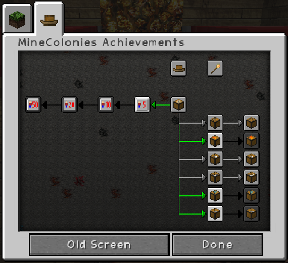
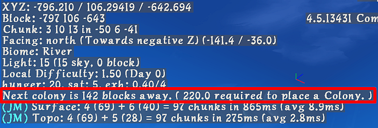
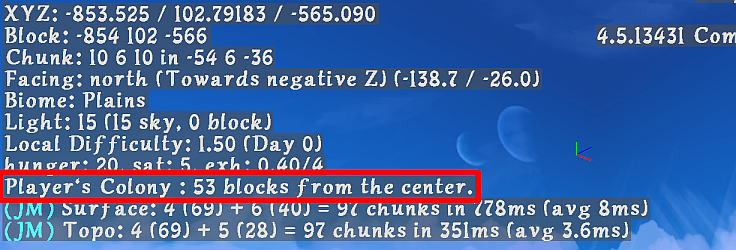
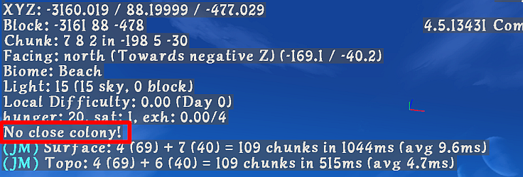

# Tutorial

<b>Hello and welcome all new and old players!</b>

If you'd like instructions on how to <a name="install">install</a> our [Official Mod Pack](https://minecraft.curseforge.com/projects/minecolonies) we have two options; instructions for the Twitch Launcher click [here](../installation/twitch) (Previously Curse launcher) or for MultiMC click [here](../installation/multimc). If you just want to install our Mod in the original Minecraft Launcher click [here](../installation/java).

## Basic Walkthrough

If you have done the installation, congratulations! You are on your way to having your own thriving colony!

But one of the first questions you should ask yourself is: "*Where should I put my town?*". When starting a new world, just play Minecraft how you normally would. Find a nice area where you could start your wonderful new town and start collecting some resources like wood, dirt, sand, gravel and cobblestone.

**Hint:** The most important tool you will need for the entire mod is the Build Tool. Craft the Build Tool so you can place all the buildings, worker huts and even the Supply Ship or Supply Camp in the perfect spot. 

<b><a name="build_tool">Build Tool Video.</a></b>

<embed width="854" height="480" src="https://www.youtube.com/embed/DVGGDUXbTOY" frameborder="10" allow="autoplay; encrypted-media" allowfullscreen>

To start your colony you need to craft either a [Supply Ship] or a [Supply Camp] first (only one of these can be placed per player per world).  By default, only one colony can be started per player per world. Place the Supply Ship/Camp block using the build tool for the best placement or by right clicking the ground and a chest will spawn exactly where you clicked on the ground. Within this chest will be a Town Hall block and a Build Tool. **This is the only way to obtain the Town Hall block, it can't be crafted.**

- **Tip**: [Supply Camp] needs an area of 16 x 12 x 17 to place down.
- **Tip**: [Supply Ship] must be placed in a large pool of water, otherwise it will not be built. This also can not be a river because it is too small; an area of 17 x 30 x 32 is required to place it.

Your first step to start your town is placing the [Town Hall] Chest. While it can be placed manually, it is far better to place the Town Hall using the Build Tool you obtained from your supply chest. The Build Tool will help you place your buildings, and using it will show you a 3D ghost outline of what the building will look like.

The next thing you should do is craft a "[Builders Hut](http://)". Once again, use the <a href="#build_tool">Build Tool</a> to place the hut so you can position the hut exactly how you want it. The builders hut will let you hire a builder and, as you may guess, the builder will build and upgrade buildings. Once built, upgrading the builder hut will enable your builder to upgrade the other buildings. In the configuration options of the mod or in the config folder of your Minecraft game you can toggle if your builder builds for free (infinite resources) or whether you have to deliver him the resources.

Currently there are 10 more Worker Huts that can be placed and built. They are: Miners Hut, Lumberjack's Hut, Fisherman's Hut, Farmer's Hut, Baker's Hut, Cook/Restaurant Hut, Herder's Hut, Smelter's Hut, Composter's Hut and the Guard's Tower (or barracks). All of these huts lets the workers gather resources if you give them the proper tools. The Lumberjack requires an axe so he can start chopping down trees and getting logs. The miner will need the first level of his building built and he needs a shovel, pickaxe, cobblestone, torches, ladders, fences, planks and slabs (all oak wood type), the Fisherman will require his hut be built first and then a fishing rod, the farmer needs his hut be built as well as for you to create the plot and place the Field (Scarecrow block) and the Guards will need the Guard Tower built first then a bow and/or a sword. Depending on the type of tools given to the workers, they will collect what that tool will allow them. Even use enchanted tools!

View all the recipes [here](recipes).

## Detailed Walkthrough

If you're here, **CONGRATULATIONS!** You have already <a href="#install">installed</a> Minecolonies and are ready to embark on an adventure to explore, conquer and establish your own Settlement. Work hard and turn it into a thriving Town. Hone your Leader skills and grow grow grow into a City. Lastly, can you be a grand leader and finally achieve a Metropolis??? (Check your ingame Minecolonies Achievements).

So, the first thing you want to do is find the perfect spot to settle down. But, before you do that, there are two things you have to consider. The following comments are the most important you should read and consider to ensure a successful Town and avoid frustration. Please read all considerations first, before placing your [Supply Ship] or [Supply Camp]. Even before starting to play:

- **Hint:** The most important tool you will need for the entire mod is the Build Tool. Craft the Build Tool so you can place all the buildings, worker huts and even the Supply Ship or Supply Camp in the perfect spot.

<b><a name="build_tool">Build Tool Video.</a></b>

<embed width="854" height="480" src="https://www.youtube.com/embed/DVGGDUXbTOY" frameborder="10" allow="autoplay; encrypted-media" allowfullscreen>

### Placement of the [Supply Ship] or [Supply Camp] 

 When you place the [Supply Ship] it will spawn a chest that will contain the Town Hall block and the Build Tool. To place the Supply Ship, you need to have a large enough body of water. The Supply Ship is 32 x 11 blocks in length and width. So the recommended body of water must be at least (32 x 20). Use the Build Tool to see where the pShip will be placed and when you place the Supply Chest a chest will appear on the exact block you right clicked. The Chest will be directly in front of the ladder to board the supply ship (8 blocks from the boarding ladder) and the ladder is not in the middle of the Supply Ship. But please take into account the Town Hall placement as well before you place your Supply Ship. **Once the Supply Ship is placed, you can't place another Ship or Camp in this World anymore.**
 
(Hint: if you're not using hte Build Tool and aren't able to place the Supply Ship, try it block by block: one to the right, left, closer or further from the water - or even directly over the water creating a walkway block by block).

 When you placed the [Supply Camp] it will spawn a chest that will contain the Town Hall block and the Buiding Tool. To place the Supply Camp, you need to have a large enough flat, clear piece of land. The recommended flat piece of land must be at least 16 x 17 blocks in size. When you place the Supply Camp a chest will appear on the exact block you right clicked. But please take into account the Town Hall placement as well before you place your Supply Camp. **Once the Supply camp is placed, you can't place another Camp or Ship in this World anymore.**

(Hint: if you're not using hte Build Tool and aren't able to place the Supply Camp, try it block by block: one to the right, left, closer or further from the area you cleared. It can not contain any holes or have any flowers, grass, fens, etc. It must be completely flat and clear.

### Town Hall

 The protected area of your Colony (once the Town Hall has been placed) will be a 8 chunks radius, measured from where you placed your Town Hall block the first time (Default config). Therefore, plan carefully where you want to place your Town Hall. 128 blocks (8 chunks x 8 chunks) in every direction will be your protected Town area including mountains, hills, lakes, oceans, caves, world generated structures, etc. from bedrock to the sky limit.

- **Note**: You can configure your own Town area radius in the configuration options of the mod or the the minecolonies.cfg file inside the "../minecraft/config/" folder of your own world. (see minecolonies config server section for details)

Due to the protected area of each Town, you have to scout carefully your surroundings to make sure you are clear of any other Towns nearby preventing you from placing your Town hall or limit your Town area in that direction.

If there is another Colony too close to your current position you won't be able to place a Town Hall.

If you want to know whether there is a colony too close to your current position we included some information in the debug screen (Displayed when you press the F3 button) which contains a real time tracker showing you the distance to the next colony, the colony you're currently in, or if there is no colony close at all plus - if there is a colony close to your current position - the required distance to place your Town Hall.

For example, in the official Minecolonies server it will be the default 8 chunk radius (8 + 8 + 1 {center Chunk where TownHall was placed} = 17 chunks or 272 total blocks required). It therefore, will tell you: "Next colony is XXX blocks away. (272 required to place a Colony)."

**Now, after you have explored, thought carefully, planned and found the perfect spot to start your own colony, let's take a look at the required steps to get your Colony running.**

## Setting Up Your Colony

### Step 1

Get enough materials and craft your Supply ship/Camp in a crafting table. Now place it with the <a href="#build_tool">Build Tool</a> or by right clicking a block with it to place your Supply Ship/Camp (which you can use as shelter, warehouse or even as materials to give to your builder). It will also give you a chest with your Town Hall block and a Build Tool after placement.

- **Hint:** Meanwhile, gather as many materials as possible to be able to give them to your builder when he starts building. He will be asking you for all kinds of materials he will need for each building or upgrade, depending on the style of building you have chosen. Mainly wood, cobblestone and torches for the starter builds. Further upgrades will require more elaborate materials.

### Step 2

After you have carefully decided where you want to place your Town Hall (Remember, the position where you placed the Town Hall block will be the center of your Town's protected area. Once placed, the area will be set and cannot be changed). Use your <a href="#build_tool">Build Tool</a> to place the Town Hall block, once you "commit" to the placement of the Town Hall, the Town hall block will be set and your Citizens will automagically appear. You can right click the Town Hall block to look at its graphical user interface.

### Town Hall GUI

You may use the tabs on the left side to switch between different categories:

- **Information.-** This will give you some statistics about your citizens and workers.
  
[File:TH_InformationGUI.png]

- **Actions.-** This is the most important tab. You are able to see your Towns name and various Buttons here:
    Build Town Hall (also upgrades it),
    Repair Town Hall (in case it gets "accidentally" modified),
    Recall Citizens (not implemented yet)
    Toggle Specialization (future use)
    and Rename Colony (in case you don't want it to have the player's name or coop playing and decide on a colony name).

[File:TH_ActionsGUI.png]

- **Permissions.-** It will show the Owner(s) and other players invited to your Town to collaborate. You can add a player and give him a status in your Town. Each status will have certain privileges in the protection system.

[File:TH_Permissions.png]

- **Citizens.-** Just the names of the Citizens. Your npc citizens, not players.

[File:TH_CitizensGUI.png]

- **Settings.-** You may set it automatic hiring mode or Manual mode. Every time a building is finished and you have an unemployed citizen, he may be automatically assigned or you can manually assign him according to his "Traits".

[File:TH_SettingsGUI.png]

- **Work Orders.-** Here you will see the work orders the Builder has in the order they have been assigned. The builder will not start another order until he has successfully completed the top one. Here you can delete any build order he has or change their priorities. When you delete a work order which is currently being built the builder will stop building and only continue when you assign him to this building again.

[File:TH_WorkOrdersGUI.png]

### Step 3

Before any building can be built, you have to craft the "Builder's hut" block in the crafting table and use your <a href="#build_tool">Build Tool</a> to place his building. Once you "commit" to the placement of the builder's hut, the block will be placed and the builder will be automatically assigned (or you can manually assign one with the best "traits" for builder if you changed this in the setting tab in the Town Hall's GUI).
You now officially have a [Builder](../workers/builder)! CONGRATULATIONS!
Now you can access the Builder's block (right click on it) and you will see a similar GUI with different options:

- The Worker assigned and his Skill Level. (you level him up by assigning more build/upgrade/repair tasks. The higher the level the faster and more efficient he/she will be). And the buttons:

- Fire Worker.- If you think you know a better Citizen for the job.
- Recall Worker.- If the builder gets stuck somewhere, or you just want to see what the builder has or give the builder something directly.
- Build/Upgrade Building.- to create the build/upgrade work order for this building.
- Repair Building.- So the builder can recreate the original building (at the current level) and fix any broken, missing, unwanted addons to the original building.
- Inventory.- This is the most important button. Here you can access the buildings storage from where the worker takes and deposits materials, tools and anything he/she finds along the way (citizens will pickup anything in their path that is considered a drop; saplings, seeds, rotten flesh, bones, arrows, etc.).

[File:Builder_Gui.png]

You will have to issue the builder the "Build" assignment so he can build his own Hut first. Without the builder's hut being built, the builder cannot build any other buildings. He will be asking for the materials he/she needs. Make sure to check the chat regularly to see what materials the builder is requesting for any build/upgrade.

- **Hint:** If you see he/she has not finished a work order and you don't see the builder asking for any materials, go to the builder's hut and recall the builder and wait a bit to see what he/she needs. Also check Pg. 2 of the Builder's Hut GUI and see what resources are in red color, those are missing resources.

### Step 4

Once the builder has finished his Hut, you're ready to start building ANY other building you want. Just craft the desired block and use your build tool to place the desired building and go into the GUI for that new block you just placed, right click on it and click on the "Build" button. That simple!

- **Hint:** Consider Upgrading the Builder's hut to level 2 as soon as you can so he may be able to upgrade any other building.

### Final Notes

You have now completed the most important steps completed to start and create your Colony.

From this point on, you should be able to place, build, upgrade and manage all your buildings and Citizens.

Your questions from this point on are probably what to build next? The [Town Hall], [Miner], [Sawmill], [Farmer], [Fisherman], [Guard], [Deliveryman], [Baker], etc.? Well, there are many answers, but you start with only 4 citizens! Now what? Well the next step after your 4 Citizens are employed and are working hard, is to plan and place the "[Citizen Hut]". This will give you additional Citizens for each level of a [Citizen Hut] you build in your Town! That's crazy, right? Now what do you do with so many Citizens? You cannot assign more than 1 worker per building. Therefore, consider building additional buildings (more miners, lumberjacks, builders, farmers, fishermen... and more to come!). Check the [Citizen Hut] section for more detailed info.

- **Hint:** Upgrade your buildings to the highest level each one has to unlock achievements (and in the future enable your worker to do more stuff).
